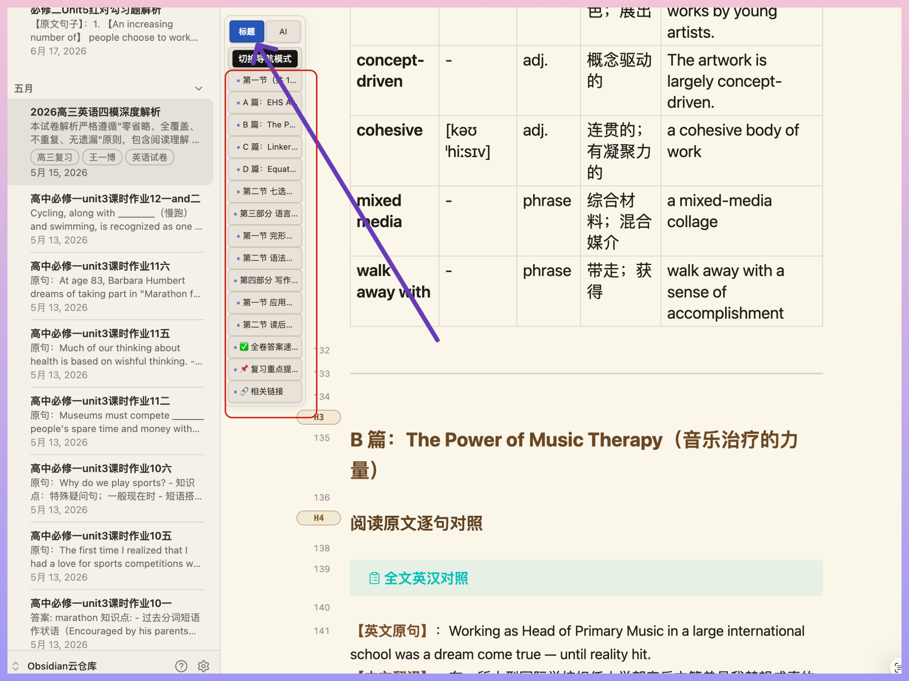
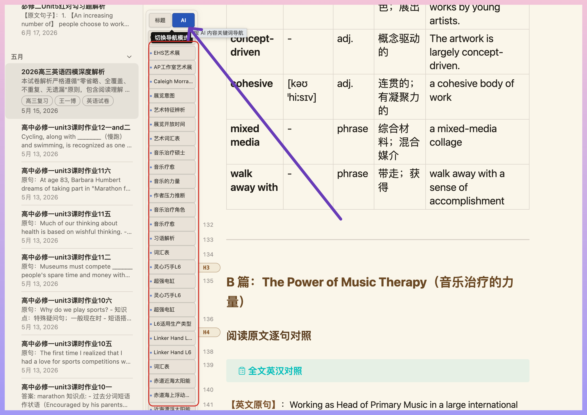

# 极简关键词导航（Keyword Rail Navigator）

给长篇 Obsidian Markdown 文档添加一条贴边的极简导航条：不用反复滑触控板，也能一键抵达想看的位置。



## 它解决什么痛点？

长文档常见的问题不是没有目录，而是目录离正文太远、标题太宽泛，或者在讲义、备课笔记、试卷解析里需要不断滚动才能找到某一段。

这个插件把导航固定在文档左侧的留白处：

- **不挡正文**：贴边显示，鼠标悬停才展开。
- **不再一点点滑动**：点一个导航项，立即跳到相应位置。
- **标题模式看结构**：直接按 H2、H3 小标题定位。
- **AI 模式看内容**：不只显示“阅读理解”“完形填空”一类框架标题，而是提炼出“袁隆平”“音乐疗法”“艺术特征解析”这类具体内容关键词。

## 两种导航模式

### 1. 标题模式：零配置、零 API 费用

默认模式。插件只读取当前文档的 **H2（二级标题）** 和 **H3（三级标题）**，生成可点击的导航。

适合：本来就有清晰标题层级的笔记、讲义、课程大纲和长篇解析。

### 2. AI 关键词模式：按内容理解文档

点击顶部的 `AI`，再点击 `↻ 提取关键词`。插件会将正文分块，并给每块生成一个短小、具体的主题词。

适合：标题只写了题型、章节或编号，但你真正想快速辨认的是“这段讲谁、讲什么事、是什么主题”的备课文档与试题解析。



AI 结果会缓存在本机。即使文档后来做了小修改、加入符号或补充文字，已生成的关键词仍会保留；只有你再次点击“重新提取”时，才会调用 API 并覆盖旧结果，不会在后台悄悄消耗额度。

## 安装

> 这是一个本地安装的 Obsidian 社区插件。暂未上架 Obsidian 社区插件市场。

1. 推荐在 [Releases](../../releases) 下载最新版本的 `keyword-rail-navigator-*.zip`；也可点击 **Code → Download ZIP**。解压下载文件。
2. 打开你的 Obsidian vault 文件夹，进入 `.obsidian/plugins/`。
3. 新建文件夹 `keyword-rail-navigator`。
4. 将下载内容中的以下三个文件复制进去：
   - `main.js`
   - `manifest.json`
   - `styles.css`
5. 重启 Obsidian，或在“设置 → 第三方插件”中刷新/重新启用插件。
6. 在当前长文档左侧留白处即可看到导航条（不同主题的颜色会略有差异）。

最终目录应为：

```text
你的 Vault/
└── .obsidian/
    └── plugins/
        └── keyword-rail-navigator/
            ├── main.js
            ├── manifest.json
            └── styles.css
```

## 使用方法

1. 打开任意 Markdown 长文。
2. 点击导航条顶部的 `标题` 或 `AI`，可随时切换模式。
3. 点击任意关键词/标题，立即跳转到文中对应位置。
4. 在 AI 模式下首次使用时，点击 `↻ 提取关键词`。

## 配置 AI 模式

在 **设置 → 第三方插件 → 极简关键词导航** 中完成配置。

支持两种 OpenAI 兼容的服务：

| 服务商 | 需要填写 |
| --- | --- |
| DeepSeek | API Key；模型名默认或填写 `deepseek-v4-flash` |
| 火山引擎方舟 | API Key、Endpoint ID，以及方舟 Chat Completions 接口地址 |

为节省额度，DeepSeek 的关键词请求会自动关闭思考模式，并将输出限制为极短关键词。API Key 仅保存于本机插件的 `data.json` 中；本仓库不会收集、上传或发送你的 Key 到任何非所选 AI 服务商。

## 隐私与费用

- 标题模式完全离线，不会联网。
- AI 模式只会把当前待分析的文档内容块发送给你选择的 AI 服务商。
- 每个内容块只要求返回一个短关键词；结果会缓存。
- 请勿将插件本地生成的 `data.json` 上传或分享，其中可能含有你的 API Key。

## 开发与反馈

欢迎提交 Issue，描述你的文档类型、期望的关键词效果或界面建议。

## License

[MIT License](LICENSE)
